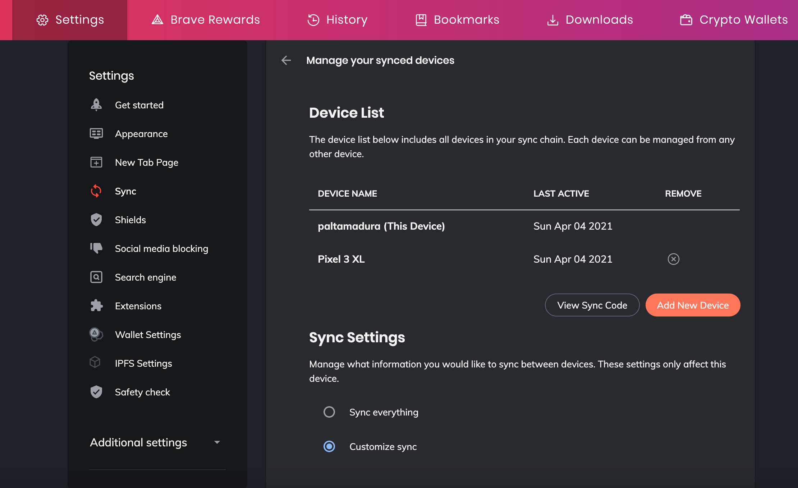
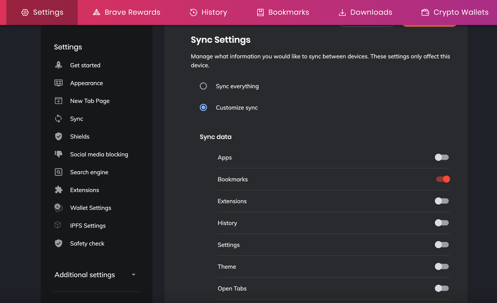
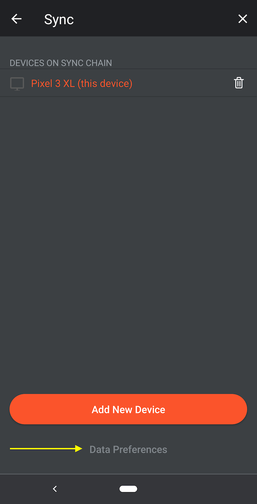
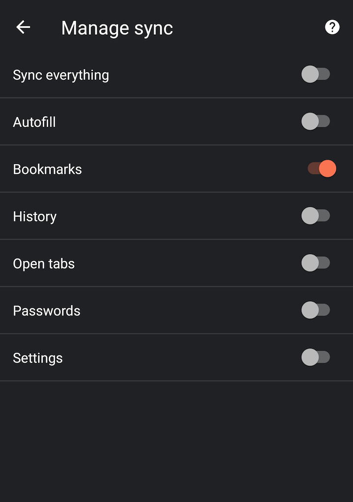

## Problem

Brave Browser Sync is not working. Passwords, history, autofill, etc. are not being synced across devices.

## Solution

Make sure you have customized the sync settings because **the default is to sync Bookmarks only**.

Here are the steps from start to finish:

1. Open Brave > Settings > Sync, and choose "Start using sync"
1. Click "Start a new Sync Chain"
1. Choose Device Type: Choose Phone/Tablet
1. You will be presented with a Sync Chain QR Code
1. Now repeat the following steps on each device you wish to sync with. 
   This example below is for Android/mobile.
1. Brave > Settings > Sync and choose "Scan or enter sync code" and scan 
   the QR code from the step above
1. Once done, you should still on the Sync settings page. This is the 
   critical part: All the way at the bottom of screen, 
   click "Data Preferences" and customize what you want to sync 
   or choose "Sync everything"
1. This is the other critical part: Back on the original device, 
   go to Brave > Settings > Sync on the original device, and 
   choose "Manage your synced devices". Scroll down until you see 
   the "Sync Settings" section. Customize what you want to sync, 
   or choose "Sync everything"

## Details

To my surprise, this was **not** a technical issue but a design and user experience issue. 
The default Sync settings are to sync Bookmarks only. This makes sense for a 
privacy-oriented browser. However, the setting are inexplicably buried in the Sync settings.  
These settings should be an explicit step in the enable Sync flow, or they should figure much 
more prominently in the Sync settings.

Not much to see on the "Manage your synced devices" page, right?

**Wrong!** It took me a few days until I even noticed that there were additional 
settings "below the fold". By default, only Bookmarks are synced.

Same story on Android. Not much to see here, right? 
**Wrong!** Check out the grayed out Data Preferences button at the bottom.

Again, by default only Bookmarks are synced.

